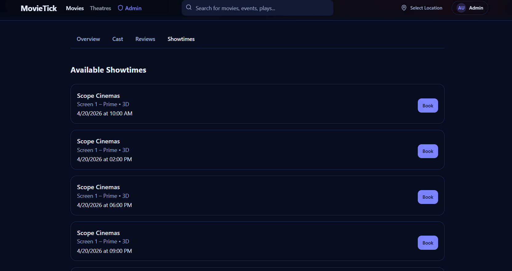
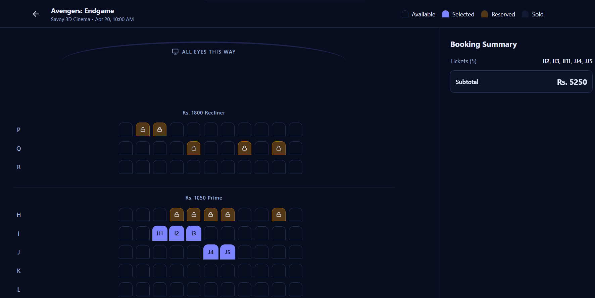
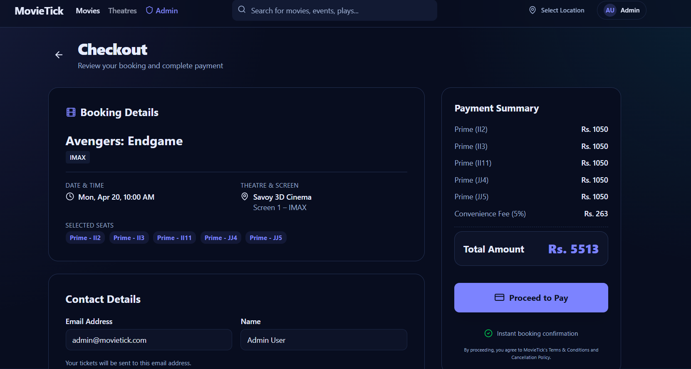
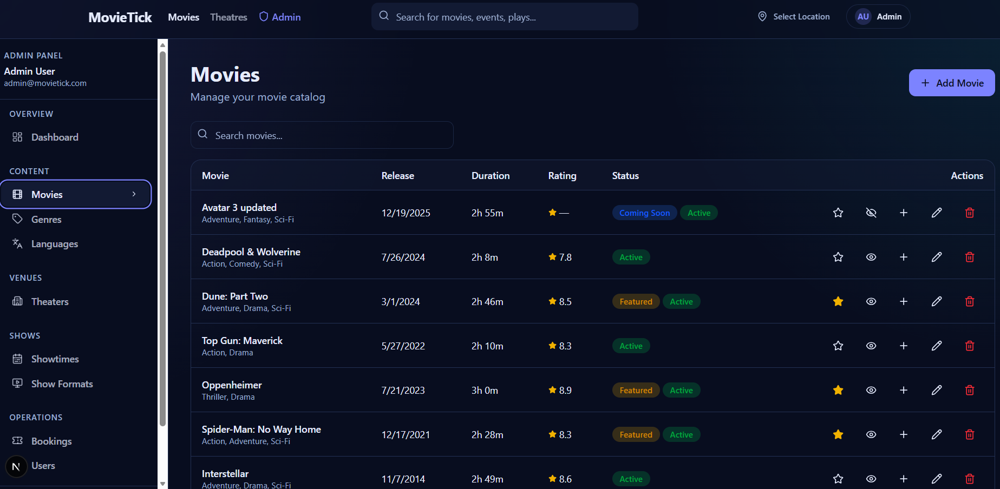
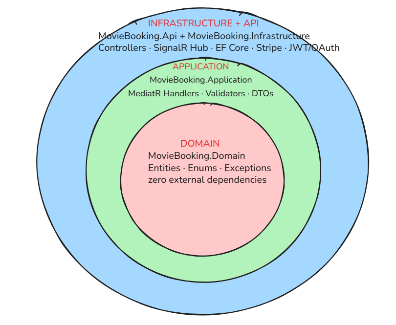
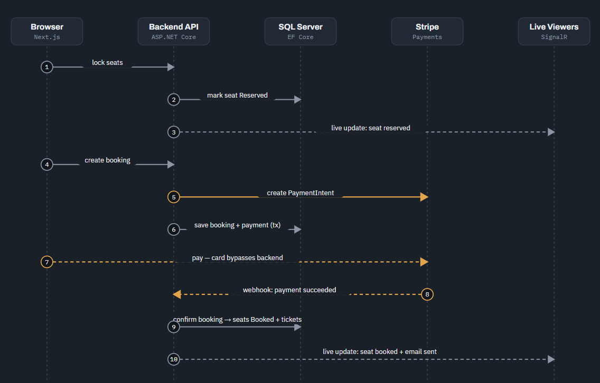

# 🎬 CinePass — Movie Ticket Booking Platform

[](https://nextjs.org/)
[](https://dotnet.microsoft.com/)
[](https://www.microsoft.com/sql-server)
[](https://tailwindcss.com/)
[](https://stripe.com/)
[](https://learn.microsoft.com/en-us/aspnet/core/signalr/introduction)
[](LICENSE)

**CinePass** is a full-stack movie ticket booking platform: browse showtimes, watch seats lock and unlock **live** as other customers pick them, pay by card through Stripe, and receive a QR-coded e-ticket by email. Built with a **Clean Architecture** backend in **.NET 8** (CQRS via MediatR) and a **Next.js 16 / React 19** frontend.

This isn't a CRUD demo — it's built around the concurrency and payment-correctness problems a real booking system has to solve: two people can't buy the same seat, a card charge can't silently lose its ticket, and a webhook that fires twice can't create two bookings. See [Engineering Highlights](#-engineering-highlights) below.

---

## 🖼️ Screenshots

> Save your screenshots to `docs/screenshots/` using the filenames below (or update the paths).

<table width="100%">
  <tr>
    <td width="50%" align="center">
      <b>Landing Page</b><br/>
      
    </td>
    <td width="50%" align="center">
      <b>Interactive Seat Selection</b><br/>
      
    </td>
  </tr>
  <tr>
    <td width="50%" align="center">
      <b>Stripe Checkout</b><br/>
      
    </td>
    <td width="50%" align="center">
      <b>Admin Dashboard</b><br/>
      
    </td>
  </tr>
</table>

---

## 🏗️ Architecture

> Save the two diagrams to `docs/architecture-layers.png` and `docs/architecture-flow.png`.

**Backend layering** — dependencies only ever point inward; `MovieBooking.Domain` has zero external references.



**A booking, start to finish** — from seat lock through Stripe payment to the (idempotent) webhook confirmation and live seat-status broadcast.



---

## ⭐ Engineering Highlights

The parts of this codebase most worth pointing to in an interview:

- **Idempotent payment confirmation** — Stripe delivers webhooks *at least once*, so `ConfirmBookingHandler` checks the booking's status first; a redelivered `payment_intent.succeeded` event is treated as a no-op instead of double-issuing tickets.
- **Transaction boundaries drawn around correctness, not convenience** — the Stripe `PaymentIntent` is created *before* the DB transaction opens (an external call should never hold a DB lock), while side effects that talk to the outside world (SignalR broadcast, confirmation email) fire only *after* the transaction commits, and never roll back a confirmed booking if they fail.
- **Real-time seat availability without polling** — a SignalR hub groups clients by showtime (`showtime-{id}`); when one customer locks or books a seat, every other browser watching that showtime updates instantly.
- **Self-healing seat locks** — a hosted background service (`SeatLockCleanupService`) periodically reclaims seats whose lock expired or whose booking was abandoned mid-checkout, so inventory never gets stuck.
- **Rate limiting scoped to the actual threat** — auth endpoints (brute force / credential stuffing) and seat-lock endpoints (griefing) each carry their own limiter, rather than one blanket policy.
- **Enforced dependency direction** — Clean Architecture isn't just a folder name here: `MovieBooking.Domain` has no project references at all; `Application` depends only on `Domain`; `Api` and `Infrastructure` are the only projects allowed to know about EF Core, Stripe, or ASP.NET.
- **CQRS + a validation pipeline** — every command/query runs through FluentValidation automatically via a MediatR pipeline behavior, so handlers never have to hand-roll input checks.

---

## 🛠️ Technology Stack

| Layer | Technologies | Key Libraries |
| :--- | :--- | :--- |
| **Frontend** | Next.js 16 (App Router), React 19, Tailwind CSS v4 | Zustand, Axios, TanStack Query, React Hook Form, Zod, Radix UI |
| **Backend API** | ASP.NET Core 8 Web API (C#) | MediatR (CQRS), FluentValidation, AutoMapper, Serilog, Swashbuckle |
| **Persistence** | Microsoft SQL Server | EF Core (code-first migrations) |
| **Real-time** | ASP.NET Core SignalR | WebSocket seat-availability broadcasts |
| **Auth** | JWT + refresh tokens | Google / Facebook / Apple OAuth |
| **Payments** | Stripe (Elements + PaymentIntents + webhooks) | Stripe.net |
| **Other services** | QR codes, email, background jobs | QRCoder, MailKit (SMTP), ASP.NET hosted services |
| **Infra** | Containerization | Docker, Docker Compose |
| **Testing** | Backend unit tests | xUnit, Moq |

---

## 📂 Project Structure

```text
├── backend
│   └── MovieTicketBooking
│       ├── MovieBooking.Api             # Controllers, SignalR hub, middleware, DI wiring, Program.cs
│       ├── MovieBooking.Application     # CQRS commands/queries, MediatR handlers, DTOs, validators, interfaces
│       ├── MovieBooking.Domain          # Entities, enums, domain exceptions — zero external dependencies
│       ├── MovieBooking.Infrastructure  # EF Core, repositories, Stripe/SMTP/JWT services, background jobs
│       ├── MovieBooking.Application.Tests
│       └── MovieTicketBooking.sln
├── frontend
│   ├── app                              # Next.js App Router pages (movies, theatres, checkout, dashboard, admin)
│   ├── components                       # Reusable UI (layout, primitives)
│   └── lib                              # API client, hooks, Zustand stores, types
├── docs                                 # Architecture diagrams and screenshots (for this README)
├── docker-compose.yml                   # SQL Server + API + frontend, containerized
└── README.md
```

---

## ⚙️ Getting Started

### Prerequisites

- **.NET 8 SDK**
- **Node.js 20+**
- **Docker Desktop** (for SQL Server, or the full containerized stack)

### 1 — Database

```bash
docker compose up sqlserver -d
```

*(Or point `backend/MovieTicketBooking/MovieBooking.Api/appsettings.Development.json` at your own SQL Server instance.)*

### 2 — Backend API

```bash
cd backend/MovieTicketBooking/MovieBooking.Api
cp .env.example .env   # fill in Stripe keys + a JWT signing key
dotnet run
```

EF Core migrations and seed data run automatically on startup. Swagger UI: `http://localhost:5000`.

### 3 — Frontend

```bash
cd frontend
npm install
npm run dev
```

Open `http://localhost:3000`.

### 🐳 Or run the full stack in Docker

```bash
docker compose up --build -d
```

| Service | URL |
| :--- | :--- |
| Frontend | `http://localhost:3000` |
| API / Swagger | `http://localhost:5000` |

---

## 🔑 Test Credentials

Seeded automatically on first run:

| Role | Email | Password |
| :--- | :--- | :--- |
| Admin | `admin@movietick.com` | `Admin@123456` |
| Customer | `jeewa@gmail.com` | `12345678` |

---

## ✅ Testing

Backend handlers are unit tested with **xUnit + Moq** (`MovieBooking.Application.Tests`):

```bash
cd backend/MovieTicketBooking
dotnet test
```

Current coverage focuses on auth, admin, and movie-rating handlers. Extending it to the booking/payment handlers and wiring up CI are the next items on the roadmap below.

---

## 🗺️ Roadmap

- [ ] Unit tests for `CreateBookingHandler`, `ConfirmBookingHandler`, and `LockSeatsHandler`
- [ ] CI pipeline (GitHub Actions) running build + tests on every PR
- [ ] Pagination on list endpoints
- [ ] Integration tests against a containerized SQL Server

---

## 🛡️ License

Licensed under the [MIT License](LICENSE).
